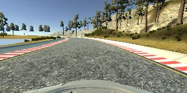
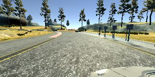
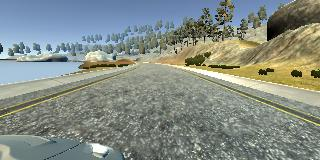

# Behaviorial Cloning Project

Overview
The objective of this project is to clone driving behavior in a simulation environment. The goal is to train, validate and test a deep learning model using Keras. The model will output a steering angle to an autonomous vehicle.

A [simulator](https://github.com/udacity/self-driving-car-sim)  was provided where a car can be steered around a track for data collection. The simulator records image data and steering angles which can be used to train a neural network and then this model can be used to drive the car autonomously around the track.

I will elaborate and explain how all the requirements specified in the rubric were achieved

### Code quality - functional and readable

The model code is available in `model.py`. It can be run using the command:
 `python model.py <path to driving_log.csv> <path to training img dir>`
 There are comments throughout the file explaining what the methods
  do. The entire training pipeline is run via  a method called `behavioral_cloning_pipeline`. There is a generator method called `data_generator` to load image data in batches.
  
### Model Architecture and Training

#### Architecture
I experimented with a few different architectures:
1. A linear model with normalization and fully connected layers only
2. LeNet architecture like model with normalization,Cropping, Convolutional layers, Dropout, Max Pooling and Dense Layers.
3. Nvidia architecture for end-to-end driving with normalization,cropping, multiple convolutions and dense fully connected layers

After training models with the same amount of train data, I could succesfully complete an autonomous lap with Nvidia architecture. The architecture that helped achieve one complete autonomous loop around Track-1 is shown below:

| Layer         		|     Description	        		| 
|:---------------------:|:---------------------------------------------:| 
| Input         		| 160 x 320 x 3 RGB image		| 
| Normalization    	| Outputs 160x320x3 	|
|Cropping| Crops top and bottom of image	|
|Convolution 5x5      	| Depth =24, activation =RELU, strides=(2,2)	|
|Convolution 5x5      	| Depth =36, activation =RELU, strides=(2,2)	|
|Convolution 5x5      	| Depth =48, activation =RELU, strides=(2,2)	|
|Dropout				| Dropout rate =0.4						|
|Convolution 3x3     	| Depth =64, activation =RELU, strides=(1,1)	|  
|Convolution 3x3     	| Depth =64, activation =RELU, strides=(1,1)	|  
|Dropout				| Dropout rate =0.4						|
|Flatten Layer			|										|
| Dense Fully Connected | OutputSize =100							|
| Dense Fully Connected | OutputSize =50							|   
| Dense Fully Connected | OutputSize =10							| 
| Dense Fully Connected | OutputSize =1							| 

The loss function used was **Min Squared Error** since the goal was cloning. Hence reducing squared error between actual and predicted steering angle seemed appropriate. The optimizer used was **Adam** optimizer.

One of the important decisions I had to make was whether I should a regularization layer or not in the Nvidia architecture. The original architecture does not show any max-pooling or dropout layers in the architecture. 
* Experiments with no dropout/max-pooling layers (total ~ 30K images inclusive of augmentation) gave sufficiently good results that the car was able a complete autonomous lap around track 1.  This did not surprise me because considering that model needs to predict a steering angle using an image is a complex enough problem that even with this many layers it will be difficult to overfit the model unless a very large dataset is used for training.  However I had to tweak the training process many times because the car kept pulling to either left or right side of the lane

* I then added two dropout layers and ran more experiments. The car was able to complete lap this time with much less pulling to any one side of the lane and almost no tweaking the left and right steering bias during the training. Hence I decied to keep the dropout layers
 
### Training
For training I collected the following data in manual mode:
1. Two laps in CW direcion
2. Two laps in CCW direction

I made sure I included some recovery style driving while driving these training laps ie driving from one edge of lane to the other with big steering angle changes.

During training, I wrote a generator method called `data_generator` which loads images in batches of 100. The simulator gives images captured from three angles: center, left and right of car along with a steering angle. I augmented the training data as below:
1. Add a flipped image for each training image from center camera
2. Add left camera image along with a angle calculated as `steering_angle - (left_bias*steering_angle)`
2. Add right camera image along with a angle calculated as `steering_angle + (right_bias*steering_angle)`

Images of training images are shown below

 

* The final model used to succesfully complete an autonomous lap on Track 1 is called `model_lap1.h5` and available [here](model_lap1.h5)
* A video of the autonomous drive is available [here](output_video/output_video_lap1.mp4) 

### Challenge Track

* I was able to train a  model for the challenge track too. It is called `model_lap2.h5` and available [here](model_lap2.h5)
* The model  was trained exclusively on challenge track data
* The model is able to drive the car around the whole track autonomously. It struggles wherever there are lighting changes and lets the car go too close to the edge.
* To improve performance, some more good training data and parameter tuning during training is still needed to make the behavior more safe and keep the car away from edge of the hilly roads. A video is available [here](output_video/output_video_lap2.mp4)

### Further Possible Exploration

1. Train a a generic model that can drive both tracks 
2. Explore comma_ai's model
3. Explore results of internediate feature maps and visualizations of learning parameters - train and validation losses
4. Use the simulator to predict/control other parameters like host vehicle speed, road curvatures etc
5. Sub-sample input image to reduce computation cost

